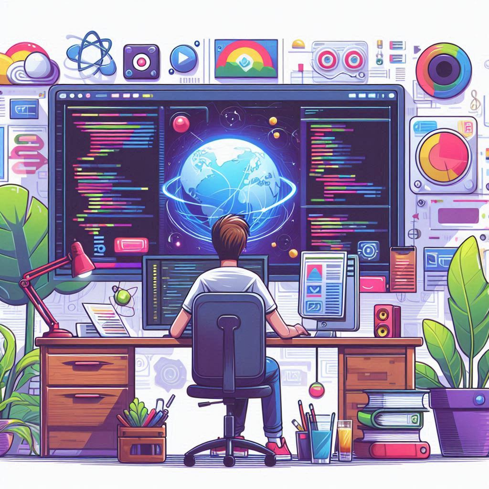

# Len Monireach Portfolio

Welcome to the personal portfolio of Len Monireach! This website showcases my skills, projects, education, certifications, and experience as a software developer. Built with React.js and modern web technologies, it provides a visually engaging and responsive experience for visitors.

## 🚀 Features

- **Project Gallery:** Explore a curated list of my software projects, including live demos and GitHub links.
- **Responsive Design:** Optimized for desktop and mobile devices.
- **Animated UI:** Smooth transitions and interactive elements using GSAP and Animate.css.
- **Profile Section:** Learn about my education, certifications, and professional background.
- **Contact Form:** Easily get in touch for collaboration or inquiries.
- **Dark/Light Theme:** Switch between themes for comfortable viewing.

## 🛠️ Tech Stack

- **Frontend:** React.js, Bootstrap, Animate.css, GSAP
- **Styling:** CSS, TailwindCSS (in projects), Daisy UI
- **Icons:** FontAwesome
- **Other:** Typewriter effect, React Animated Cursor

## 📁 Project Structure

```
Len-Monireach-Portfolio/
├── public/
│   ├── images/
│   ├── profile/
│   └── index.html
├── src/
│   ├── components/
│   ├── animatehook/
│   ├── constants/
│   ├── theme/
│   ├── App.js
│   ├── App.css
│   └── index.js
├── package.json
└── README.md
```

## 📦 Installation

1. **Clone the repository:**
   ```sh
   git clone https://github.com/monireach2480/Len-Monireach-Portfolio.git
   cd Len-Monireach-Portfolio
   ```

2. **Install dependencies:**
   ```sh
   npm install
   ```

3. **Start the development server:**
   ```sh
   npm start
   ```

4. **Open in browser:**
   Visit `http://localhost:3000`

## 🖼️ Screenshots


*Modern, clean, and interactive UI.*

## 📚 Projects

See the [public/profile/projects.json](public/profile/projects.json) file for a full list of featured projects, including:
- Full-Stack Chat Application (MERN)
- Ecomerce Application
- Relaxa Social Media Web App (Next.js, TypeScript)
- Paradise Nursery Shopping App (React.js)


## 📄 License

This project is open source and available under the [MIT License](LICENSE).

## 🙋‍♂️ Contact

- **Email:** lenmonireach123@gmail.com
- **LinkedIn:** [Len Monireach](https://www.linkedin.com/in/monireach2480/)
- **GitHub:** [monireach2480](https://github.com/monireach2480)

---

Thank you for visiting my portfolio! Feel free to explore, connect, or collaborate.
